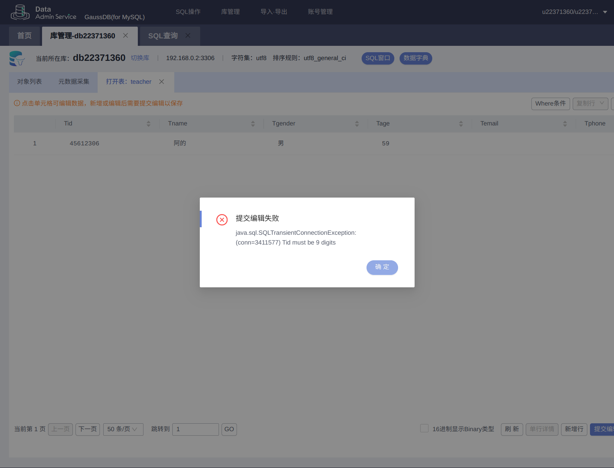

## 任务一 

### `Student` 表

#### 内容

|  字段名   |     类型      |     约束      |
| :-------: | :-----------: | :-----------: |
|   `Sid`   |   `char(8)`   | `PRIMARY KEY` |
|  `Sname`  | `varchar(20)` |  `NOT NULL`   |
| `Sgender` | `varchar(2)`  |  `NOT NULL`   |
|  `Sage`   |   `int(4)`    |  `NOT NULL`   |

#### 约束 `SQL`

- `Sid` 八位纯数字约束：

  ```sql
  DELIMITER $
  CREATE TRIGGER check_sid_isnum 
  BEFORE INSERT ON Student 
  FOR EACH ROW 
  BEGIN
      IF NEW.Sid NOT REGEXP '^[0-9]{8}$' THEN
          SIGNAL SQLSTATE '45000' 
          SET MESSAGE_TEXT = 'Sid must be 8 digits';
      END IF;
  END$
  DELIMITER ;
  ```

  效果：

  

- `Sage` 必须大于 0 且小于等于 200约束：

  ```sql
  DELIMITER $
  CREATE TRIGGER check_sage_isright
  BEFORE INSERT ON Student 
  FOR EACH ROW 
  BEGIN
      IF NEW.Sage <= 0 OR NEW.Sage > 200 THEN
          SIGNAL SQLSTATE '45000' 
          SET MESSAGE_TEXT = 'illegal age';
      END IF;
  END$
  DELIMITER ;
  ```

  效果：

  

### `Course` 表

#### 内容

|  字段名   |     类型      |     约束      |
| :-------: | :-----------: | :-----------: |
|   `Cid`   |   `char(8)`   | `PRIMARY KEY` |
|  `Cname`  | `varchar(30)` |  `NOT NULL`   |
|  `Ctype`  | `varchar(10)` |  `NOT NULL`   |
| `Ccredit` |   `tinyint`   |  `NOT NULL`   |
|   `Tid`   |   `char(9)`   | `FOREIGN KEY` |


### `Teacher` 表

#### 内容

|  字段名   |      类型      |     约束      |
| :-------: | :------------: | :-----------: |
|   `Tid`   |   `char(9)`    | `PRIMARY KEY` |
|  `Tname`  | `varchar(20)`  |  `NOT NULL`   |
| `Tgender` |  `varchar(2)`  |  `NOT NULL`   |
|  `Tage`   |   `smallint`   |  `NOT NULL`   |
| `Temail`  | `varchar(127)` |               |
| `Tphone`  | `varchar(30)`  |   `UNIQUE`    |

#### 约束

- `Tid` 九位纯数字约束：

  ```sql
  DELIMITER $
  CREATE TRIGGER check_Tid_isnum 
  BEFORE INSERT ON Teacher 
  FOR EACH ROW 
  BEGIN
      IF NEW.Tid NOT REGEXP '^[0-9]{9}$' THEN
          SIGNAL SQLSTATE '45000' 
          SET MESSAGE_TEXT = 'Tid must be 9 digits';
      END IF;
  END$
  DELIMITER ;
  ```

  效果：

- `Tage` 约束：

  ```sql
  DELIMITER $
  CREATE TRIGGER check_tage_isright
  BEFORE INSERT ON Student 
  FOR EACH ROW 
  BEGIN
      IF NEW.Tage <= 0 OR NEW.Tage > 200 THEN
          SIGNAL SQLSTATE '45000' 
          SET MESSAGE_TEXT = 'illegal age';
      END IF;
  END$
  DELIMITER ;
  ```

- `Tphone` 唯一约束：

  ```sql
  ALTER TABLE Teacher
  ADD CONSTRAINT unique_phone UNIQUE (Tphone);
  ```

  


