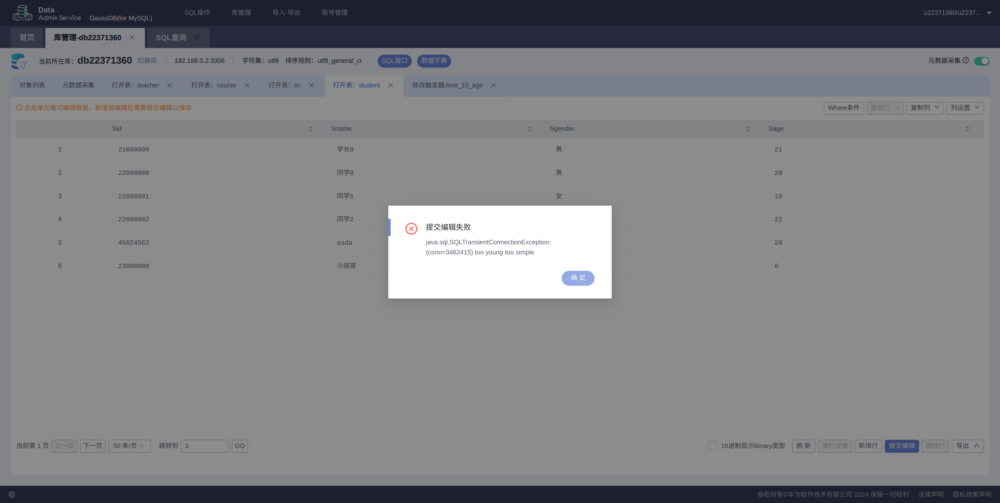
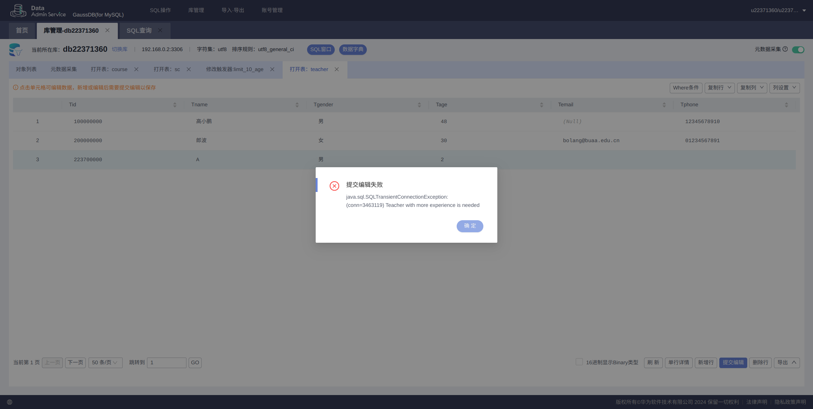

## 任务一 ：建表、完善约束

### `Student` 表

#### 内容

|  字段名   |     类型      |     约束      |
| :-------: | :-----------: | :-----------: |
|   `Sid`   |   `char(8)`   | `PRIMARY KEY` |
|  `Sname`  | `varchar(20)` |  `NOT NULL`   |
| `Sgender` | `varchar(2)`  |  `NOT NULL`   |
|  `Sage`   |   `int(4)`    |  `NOT NULL`   |

#### 约束 `SQL`

- `Sid` 八位纯数字约束：

  ```sql
  DELIMITER $
  CREATE TRIGGER check_sid_isnum 
  BEFORE INSERT ON Student 
  FOR EACH ROW 
  BEGIN
      IF NEW.Sid NOT REGEXP '^[0-9]{8}$' THEN
          SIGNAL SQLSTATE '45000' 
          SET MESSAGE_TEXT = 'Sid must be 8 digits';
      END IF;
  END$
  DELIMITER ;
  ```

  效果：

  

- `Sage` 必须大于 0 且小于等于 200约束：

  ```sql
  DELIMITER $
  CREATE TRIGGER check_sage_isright
  BEFORE INSERT ON Student 
  FOR EACH ROW 
  BEGIN
      IF NEW.Sage <= 0 OR NEW.Sage > 200 THEN
          SIGNAL SQLSTATE '45000' 
          SET MESSAGE_TEXT = 'illegal age';
      END IF;
  END$
  DELIMITER ;
  ```

  效果：

  

### `Course` 表

#### 内容

|  字段名   |     类型      |     约束      |
| :-------: | :-----------: | :-----------: |
|   `Cid`   |   `char(8)`   | `PRIMARY KEY` |
|  `Cname`  | `varchar(30)` |  `NOT NULL`   |
|  `Ctype`  | `varchar(10)` |  `NOT NULL`   |
| `Ccredit` |   `tinyint`   |  `NOT NULL`   |
|   `Tid`   |   `char(9)`   | `FOREIGN KEY` |

#### 约束

- `Cid` 固定八位纯数字：

  ```sql
  DELIMITER $
  CREATE TRIGGER check_cid_isnum 
  BEFORE INSERT ON Course 
  FOR EACH ROW 
  BEGIN
      IF NEW.Cid NOT REGEXP '^[0-9]{8}$' THEN
          SIGNAL SQLSTATE '45000' 
          SET MESSAGE_TEXT = 'Cid must be 8 digits';
      END IF;
  END$
  DELIMITER ;
  ```

- `Ccredit` 范围约束：

  ```sql
  DELIMITER $
  CREATE TRIGGER check_credit_isright
  BEFORE INSERT ON Course
  FOR EACH ROW 
  BEGIN
      IF NEW.Ccredit < 0 OR NEW.Ccredit > 99 THEN
          SIGNAL SQLSTATE '45000' 
          SET MESSAGE_TEXT = 'illegal credit';
      END IF;
  END$
  DELIMITER ;
  ```

  

### `Teacher` 表

#### 内容

|  字段名   |      类型      |     约束      |
| :-------: | :------------: | :-----------: |
|   `Tid`   |   `char(9)`    | `PRIMARY KEY` |
|  `Tname`  | `varchar(20)`  |  `NOT NULL`   |
| `Tgender` |  `varchar(2)`  |  `NOT NULL`   |
|  `Tage`   |   `smallint`   |  `NOT NULL`   |
| `Temail`  | `varchar(127)` |               |
| `Tphone`  | `varchar(30)`  |   `UNIQUE`    |

#### 约束

- `Tid` 九位纯数字约束：

  ```sql
  DELIMITER $
  CREATE TRIGGER check_Tid_isnum 
  BEFORE INSERT ON Teacher 
  FOR EACH ROW 
  BEGIN
      IF NEW.Tid NOT REGEXP '^[0-9]{9}$' THEN
          SIGNAL SQLSTATE '45000' 
          SET MESSAGE_TEXT = 'Tid must be 9 digits';
      END IF;
  END$
  DELIMITER ;
  ```

  效果：

- `Tage` 约束：

  ```sql
  DELIMITER $
  CREATE TRIGGER check_tage_isright
  BEFORE INSERT ON Student 
  FOR EACH ROW 
  BEGIN
      IF NEW.Tage <= 0 OR NEW.Tage > 200 THEN
          SIGNAL SQLSTATE '45000' 
          SET MESSAGE_TEXT = 'illegal age';
      END IF;
  END$
  DELIMITER ;
  ```

- `Tphone` 唯一约束：

  ```sql
  ALTER TABLE Teacher
  ADD CONSTRAINT unique_phone UNIQUE (Tphone);
  ```


### `SC` 表

#### 内容

| 字段名  |   类型    |     约束      |
| :-----: | :-------: | :-----------: |
|  `Sid`  | `char(8)` | `FOREIGN KEY` |
|  `Cid`  | `char(8)` | `FOREIGN KEY` |
| `Score` | `tinyint` |               |

#### 约束

- `Score` 不可超过 100，不可为负

  ```sql
  DELIMITER $
  CREATE TRIGGER check_score
  BEFORE INSERT ON SC
  FOR EACH ROW
  BEGIN
  	IF NEW.Score < 0 OR NEW.Score > 100 THEN
  		SIGNAL SQLSTATE '45000' 
  		SET MESSAGE_TEXT = 'illegal score';
  	END IF;
  END$
  DELIMITER ;
  
  DELIMITER $
  CREATE TRIGGER check_score_update
  BEFORE UPDATE ON SC
  FOR EACH ROW
  BEGIN
  	IF NEW.Score < 0 OR NEW.Score > 100 THEN
  		SIGNAL SQLSTATE '45000' 
  		SET MESSAGE_TEXT = 'illegal score';
  	END IF;
  END$
  DELIMITER ;
  ```

## 任务二：插入数据

#### 云数据库的特性

- 形象的图形化界面，操作方便
- 可以通过第三方提供的软件支持，对数据库进行监控和性能优化
- 安全程度高，有各种加密以及身份验证、访问控制
- 云数据库由云服务商进行维护，简化了用户的运维工作

#### 分布式数据库的特性

- 数据分片：通过将数据分片（分区）存储在不同的节点上来提高性能。每个节点处理部分数据集的存储和查询任务，从而降低了单个节点的负载，并提高了并发处理能力
- 横向拓展：分布式数据库可以通过添加更多节点来增加处理能力，而不是依赖于单一的高性能机器。这种横向扩展使系统能够处理更大的数据量和更高的并发负载
- 分布式数据库通过数据复制和多副本机制提供容错和高可用性。即使某些节点出现故障，其他节点可以继续处理请求，确保数据库的正常运行

## 任务三：查询数据

### 查询所有数据

#### `teacher` 表


#### `sc` 表


#### `course` 表


#### `student` 表


### 自定义查询

#### 查询性别为男的教师教授的学分不少于5的课程中，成绩在80分以上的学生的姓名

- `sql`：

  ```sql
  SELECT sc.Sid, sc.Cid, sc.Score , teacher.Tname 
  FROM sc
  JOIN student ON sc.Sid = student.Sid 
  JOIN course ON sc.Cid = course.Cid 
  JOIN teacher ON course.Tid = teacher.Tid 
  WHERE teacher.Tgender = '男' AND course.Ccredit >= 5 AND sc.Score > 80;
  ```

- 结果：

## 任务四：视图和索引

### 视图 `Sc-22`（条件为 22）

- `sql`：

  ```sql
  SELECT Sid, Cid, Score
  FROM Sc
  WHERE Sid LIKE '22%';
  ```

- 结果：

### 索引

- `sql`：

  ```sql
  ALTER TABLE teacher 
  ADD INDEX `22371360` (Tid, Tname ,Tage );
  
  ALTER TABLE `db22371360`.`teacher`
  	ADD KEY `22371360`(`Tid`, `Tname`, `Tage`) USING HASH;
  ```

- 结果：

## 任务五：更新数据

- 更新为必修课：

  ```sql
  UPDATE course AS c1
  JOIN (
      SELECT Cid
      FROM course
      ORDER BY Cid DESC
      LIMIT 2
  ) AS c2 ON c1.Cid = c2.Cid
  SET c1.Ctype = '必修';
  ```

- 将**郎波**老师教授的所有课的学生的成绩改为 **100** 分：

  ```sql
  UPDATE sc
  JOIN course ON sc.Cid = course.Cid
  JOIN teacher ON teacher.Tid = course.Tid
  SET sc.Score = '100'
  WHERE teacher.Tname = '郎波';
  ```

- 结果：

  - 有以下好处：
    1. 主库更新备库查询，可以降低主库的负载，同时提高并发程度
    2. 如果主库出现问题，并不影响备库的查询，提高了数据库的可用性
    3. 数据更安全，备库不能写就保证了数据不会被恶意修改

## 任务六：删除数据

#### 删除学号为45624562的学生

- `sql`：

  ```sql
  DELETE FROM student WHERE Sid = '45624562';
  ```

- 结果：

#### 将分数大于等于99的学生选课记录移除

- `sql`：

  ```sql
  DELETE FROM sc WHERE Score > 99;
  ```

- 结果：

## 任务七：触发器

### `GaussDB` 自带的触发器

限制年龄小于等于 **10** 岁的学生信息无法插入

- `sql`：

  ```sql
  begin
  	IF NEW.Sage <= 10 THEN
      	SIGNAL SQLSTATE '45000' 
  		SET MESSAGE_TEXT = 'too young too simple';
  	END IF;
  end
  ```

- 结果：

### 自定义触发器

限制年龄小于等于 **30** 的教师信息无法插入

- `sql`：

  ```sql
  DELIMITER $
  CREATE TRIGGER limit_teacher_age
  BEFORE INSERT ON teacher 
  FOR EACH ROW 
  BEGIN
      IF NEW.Tage <= 30 THEN
          SIGNAL SQLSTATE '45000' 
          SET MESSAGE_TEXT = 'Teacher with more experience is needed';
      END IF;
  END$
  DELIMITER ;
  ```

- 结果：


