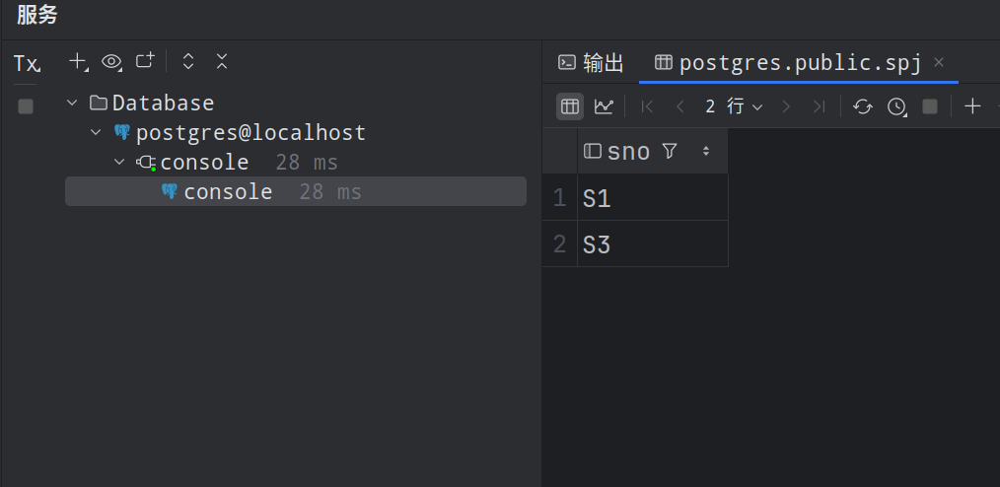
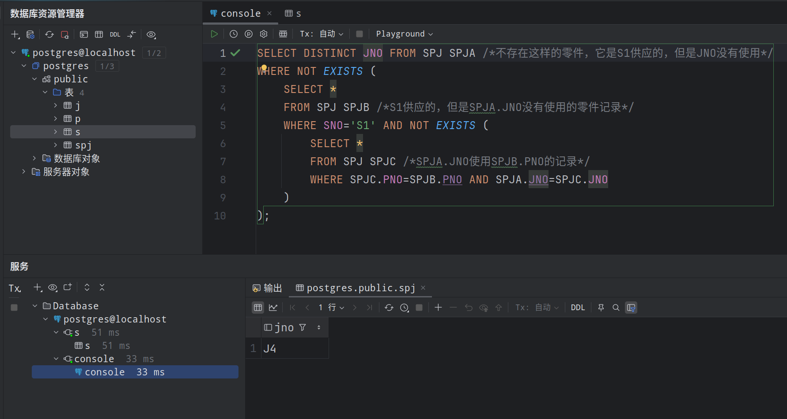

## 第三次理论作业

### 第一题

`SQL` 的特点有：

- 综合统一，集数据定义语言、数据操纵语言和数据控制语言的功能于一体
- 高度非过程化，使用 `SQL` 语言时只要提出“做什么”，无须指明怎么做，因此无须了解存储路径。存储路径的选择以及 `SQL` 语言的操作过程由数据库系统自动完成
- 面向集合的操纵方式， `SQL` 语言采用集合操作方式，操作对象、查找结果是元组的集合，一次插入、删除、更新操作的对象也可以是元组的集合
- 即是自含式语言，也是嵌入式语言

### 第三题

#### 1. $\sigma_{A = 10}(S)$

```sql
SELECT * FROM S WHERE A = 10
```

#### 2. $\pi_{A,B}(S)$

```sql
SELECT DISTINCT A, B FROM S
```

#### 3. $S\bowtie T$	

```sql
SELECT A,B,S.C,S.D,E,F 
FROM S,T
WHERE S.C=T.C AND S.D=T.D
```

#### 4. $S\bowtie_{S.C=T.C} T$

```sql
SELECT A,B,S.C,S.D,T.C,T.D,E,F 
FROM S,T
WHERE S.C=T.C
```

#### 5. $S\bowtie_{A<E}T$

```sql
SELECT A,B,S.C,S.D,T.C,T.D,E,F 
FROM S,T
WHERE A<E
```

#### 6. $\pi_{C,D}(S)\times T$

```sql
SELECT S1.C,S1.D,T.C,T.D,E,F
FROM T, (
	SELECT DISTINCT C,D FROM S
)AS S1
```

### 第四题

#### 建表

```sql
CREATE TABLE S (
    SNO CHAR(3),
    SNAME CHAR(10),
    STATUS CHAR(2),
    CITY CHAR(10)
);
CREATE TABLE P (
	PNO CHAR(3),
    PNAME CHAR(10),
    COLOR CHAR(4),
    WEIGHT INT
);
CREATE TABLE J (
	JNO CHAR(3),
    JNAME CHAR(10),
    CITY CHAR(10)
);
CREATE TABLE SPJ (
	SNO CHAR(3),
    PNO CHAR(3),
    JNO CHAR(3),
    QTY INT
);
```

#### 插入数据

```sql
INSERT INTO S VALUES('S1','精益',20,'天津');
INSERT INTO S VALUES('S2','盛锡',10,'北京');
INSERT INTO S VALUES('S3','东方红',30,'北京');
INSERT INTO S VALUES('S4','丰泰盛',20,'天津');
INSERT INTO S VALUES('S5','为民',30,'上海');

INSERT INTO P VALUES('P1','螺母','红',12);
INSERT INTO P VALUES('P2','螺栓','绿',17);
INSERT INTO P VALUES('P3','螺丝刀','蓝',14);
INSERT INTO P VALUES('P4','螺丝刀','红',14);
INSERT INTO P VALUES('P5','凸轮','蓝',40);
INSERT INTO P VALUES('P6','齿轮','红',30);

INSERT INTO J VALUES('J1','三建','北京');
INSERT INTO J VALUES('J2','一汽','长春');
INSERT INTO J VALUES('J3','弹簧厂','天津');
INSERT INTO J VALUES('J4','造船厂','天津');
INSERT INTO J VALUES('J5','机车厂','唐山');
INSERT INTO J VALUES('J6','无线电厂','常州');
INSERT INTO J VALUES('J7','半导体厂','南京');

INSERT INTO SPJ VALUES('S1','P1','J1',200);
INSERT INTO SPJ VALUES('S1','P1','J3',100);
INSERT INTO SPJ VALUES('S1','P1','J4',700);
INSERT INTO SPJ VALUES('S1','P2','J2',100);
INSERT INTO SPJ VALUES('S2','P3','J1',400);
INSERT INTO SPJ VALUES('S2','P3','J2',200);
INSERT INTO SPJ VALUES('S2','P3','J4',500);
INSERT INTO SPJ VALUES('S2','P3','J5',400);
INSERT INTO SPJ VALUES('S2','P5','J1',400);
INSERT INTO SPJ VALUES('S2','P5','J2',100);
INSERT INTO SPJ VALUES('S3','P1','J1',200);
INSERT INTO SPJ VALUES('S3','P3','J1',200);
INSERT INTO SPJ VALUES('S4','P5','J1',100);
INSERT INTO SPJ VALUES('S4','P6','J3',300);
INSERT INTO SPJ VALUES('S4','P6','J4',200);
INSERT INTO SPJ VALUES('S5','P2','J4',100);
INSERT INTO SPJ VALUES('S5','P3','J1',200);
INSERT INTO SPJ VALUES('S5','P6','J2',200);
INSERT INTO SPJ VALUES('S5','P6','J4',50);
```

#### 结果


#### 回答

- 供应工程 `J1` 零件的供应商号码 `SNO`

  - ```sql
    SELECT DISTINCT SNO FROM SPJ WHERE JNO='J1';
    ```

  - 

- 供应工程 `J1` 零件 `P1` 的供应商号码 `SNO`

  - ```sql
    SELECT SNO FROM SPJ WHERE JNO='J1' AND PNO='P1';
    ```

  - 

- 供应工程 `J1` 零件为红色的供应商号码 `SNO`

  - ```sql
    SELECT SNO FROM SPJ
    WHERE JNO='J1' AND PNO IN (
    	SELECT PNO FROM P
        WHERE COLOR='红'
    );
    ```

  - 

- 没有使用天津供应商生产的红色零件的工程号 `JNO`

  - ```sql
    SELECT JNO FROM J
    MINUS  /*mysql*/
    SELECT JNO FROM SPJ /*使用了天津供应商生产的红色零件的工程号 `JNO`*/
    WHERE PNO IN (
    	SELECT PNO FROM P
        WHERE COLOR='红'
    ) AND SNO IN(
    	SELECT SNO FROM S
        WHERE CITY='天津'
    );
    ```

  - 

- 至少使用了供应商 `S1` 所供应的全部零件的工程号 `JNO`

  - ```sql
    SELECT DISTINCT JNO FROM SPJ SPJA /*不存在这样的零件，它是S1供应的，但是JNO没有使用*/
    WHERE NOT EXISTS (
    	SELECT * 
        FROM SPJ SPJB /*S1供应的，但是SPJA.JNO没有使用的零件记录*/
        WHERE SNO='S1' AND NOT EXISTS (
        	SELECT * 
            FROM SPJ SPJC /*SPJA.JNO使用SPJB.PNO的记录*/
            WHERE SPJC.PNO=SPJB.PNO AND SPJA.JNO=SPJC.JNO
        )
    );
    ```

  - 

### 第五题

#### 找出所有供应商的姓名和所在城市

```sql
SELECT SNAME,CITY FROM S;
```


#### 找出所有零件的名称、颜色、重量

```sql
SELECT PNAME,COLOR,WEIGHT FROM P;
```


#### 找出使用供应商 `S1` 所供应零件的工程号码

```sql
SELECT JNO FROM SPJ WHERE SNO='S1';
```


#### 找出工程项目 `J2` 使用的各种零件的名称及其数量

```sql
SELECT P.PNAME,SPJ.QTY
FROM P,SPJ
WHERE SPJ.JNO='J2' AND SPJ.PNO=P.PNO;
```


#### 找出上海厂商供应的所有零件号码

```sql
SELECT DISTINCT PNO FROM SPJ
WHERE SNO IN (
	SELECT SNO FROM S
    WHERE CITY='上海'
);
```


#### 找出使用上海产的零件的工程名称

```sql
SELECT DISTINCT JNAME FROM J
WHERE JNO IN (
	SELECT JNO 
    FROM SPJ,S
    WHERE SPJ.SNO=S.SNO AND S.CITY='上海'
);
```


